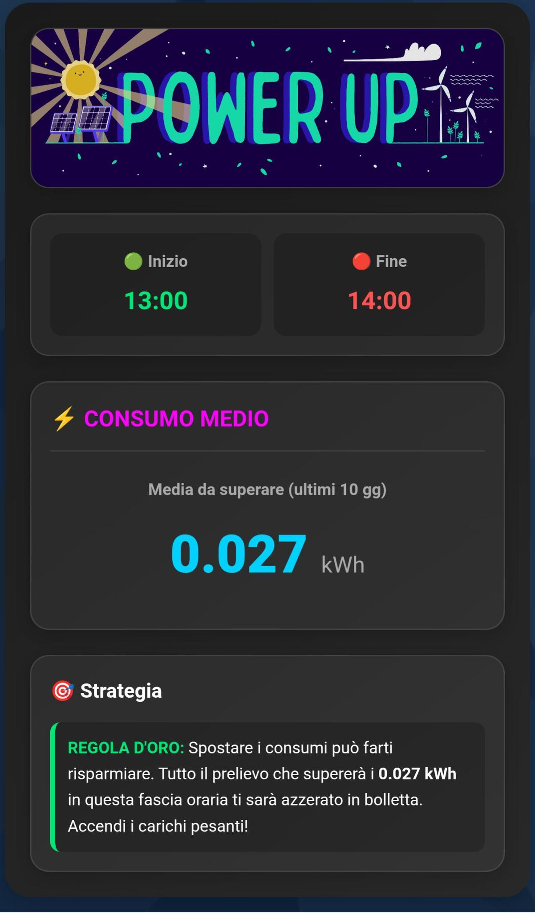

# 🐙 DomHouse Octopus PowerUp Card per Home Assistant

Una Custom Card dal design premium per monitorare in tempo reale le tue sfide **Octopus PowerUp** su Home Assistant.  
Questa card è il compagno visivo perfetto per l'integrazione [Octopus PowerUp Helper](https://github.com/SalvatoreITA/Octopus-PowerUp-Helper/).

  

## 🎁 Sconto Octopus

Se devi attivare un nuovo abbonamento con Octopus Energy puoi usare questo [link](https://octopusenergy.it/octo-friends/quiet-gaur-553): otterrai **uno sconto fino a 50 €**

## ✨ Caratteristiche
- 🎨 **Design Moderno:** Effetto "Glassmorphism", sfumature e supporto nativo al Tema Scuro/Chiaro di Home Assistant.
- 🖱️ **Completamente Interattiva:** Clicca sui riquadri degli orari direttamente dalla plancia per modificarli al volo. La card si aggiornerà in un lampo.
- ⚙️ **100% UI Editor:** Nessun codice YAML da scrivere. La card dispone di un editor grafico completo per attivare/disattivare il pannello "Strategia" o forzare il tema scuro.
- 🔌 **Plug & Play:** Rileva automaticamente i sensori creati dall'integrazione ufficiale senza doverli configurare a mano.

## ⚠️ Prerequisiti
Per far funzionare questa card, **DEVI** prima installare il componente base che calcola i dati.
👉 **[Scarica l'integrazione backend da qui](https://github.com/SalvatoreITA/Octopus-PowerUp-Helper/)**.

## 📦 Installazione

### Metodo 1: Tramite HACS (Consigliato)
Poiché la card non è ancora tra i repository predefiniti di HACS, puoi aggiungerla facilmente:

1. Apri **HACS** nel tuo Home Assistant.
2. Vai nella sezione **Frontend** (o Interfaccia Utente).
3. Clicca sui tre puntini in alto a destra e seleziona **Repository personalizzati**.
4. Incolla l'URL di questo repository: `https://github.com/SalvatoreITA/DomHouse-Octopus-PowerUp-Card`
5. Scegli la categoria **Lovelace** (o Dashboard) e clicca su Aggiungi.
6. Cerca "DomHouse Octopus PowerUp", clicca su **Scarica** e ricarica la pagina del browser.

### Metodo 2: Manuale
1. Scarica il file `domhouse-octopus-powerup-card.js` dall'ultima release.
2. Copia il file nella cartella `/config/www/` del tuo Home Assistant.
3. Vai su **Impostazioni > Plance > Risorse** (potresti dover attivare la Modalità Avanzata nel tuo profilo utente per vedere questa voce).
4. Aggiungi una risorsa con URL `/local/domhouse-octopus-powerup-card.js` e seleziona il tipo **Modulo JavaScript**.
5. Ricarica la pagina.

## ⚙️ Come Usarla

1. Vai sulla tua Plancia (Dashboard) di Home Assistant.
2. Clicca sulla matita in alto a destra per **Modificare la plancia**.
3. Clicca su **Aggiungi Scheda**.
4. Scorri l'elenco o cerca **"DomHouse Octopus Card - PowerUp"**.
5. Usa l'editor visivo per personalizzare il titolo o nascondere i suggerimenti di strategia.
6. Salva e goditi il tuo PowerUp!

## ☕ Supporta il Progetto

Ogni piccolo supporto fa un'enorme differenza: mi aiuta a mantenere vivo l'entusiasmo e mi stimola a creare e condividere nuove soluzioni per la community. Grazie di cuore per il tuo aiuto! 🚀

## ❤️ Crediti
Sviluppato da [Salvatore Lentini - DomHouse.it](https://www.domhouse.it)
